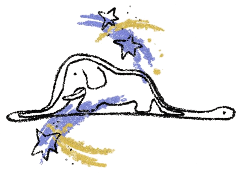
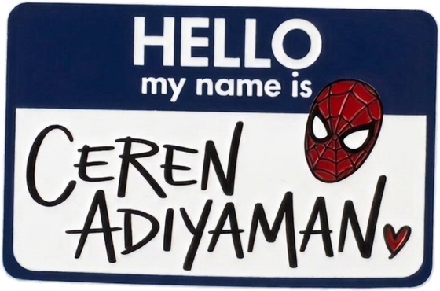
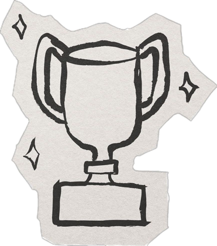

<!-- ═════════════════════════════════════════════════════════════════ -->
<!--                            ✦  HEADER  ✦                          -->
<!-- ═════════════════════════════════════════════════════════════════ -->

<div align="center">

<picture>
  <source media="(prefers-color-scheme: dark)" srcset="assets/melting-dark.png" />
  
</picture>


<samp>B.Sc.&nbsp;Computer&nbsp;Engineering,&nbsp;ESOGÜ&nbsp;&nbsp;·&nbsp;&nbsp;Cloud&nbsp;&&nbsp;AI&nbsp;Engineer&nbsp;&nbsp;·&nbsp;&nbsp;Türkiye&nbsp;🇹🇷</samp>

<br/>

<a href="https://cerenadiyaman.com/" title="Portfolio"></a>
<a href="https://www.linkedin.com/in/ceren-adıyaman" title="LinkedIn"></a>
<a href="mailto:cerenadiyamn@gmail.com" title="Email"></a>
<br/>

</div>

<br/>

<!-- ═════════════════════════════════════════════════════════════════ -->
<!--                            ✦  WHOAMI  ✦                          -->
<!-- ═════════════════════════════════════════════════════════════════ -->

## `01` — whoami

<table>
<tr>
<td width="58%" valign="top">

```yaml
interests:  [ Artificial Intelligence, Machine Learning, Cloud Technologies ]
building:   [ AI agents, computer vision, backend systems ]
```

</td>
<td width="42%" align="center" valign="top">



</td>
</tr>
</table>

Computer Engineering graduate interested in artificial intelligence, machine learning and cloud technologies.

I work on AI agents, computer vision, backend development and cloud infrastructure, and I like projects that use real-world data and actually get deployed.

---

<!-- ═════════════════════════════════════════════════════════════════ -->
<!--                            ✦  STACK  ✦                           -->
<!-- ═════════════════════════════════════════════════════════════════ -->

## `02` — stack

<div align="center">


<sub>


</sub>

</div>

---

<!-- ═════════════════════════════════════════════════════════════════ -->
<!--                          ✦  HIGHLIGHTS  ✦                        -->
<!-- ═════════════════════════════════════════════════════════════════ -->

## `03` — highlights

<div align="center">



### Huawei ICT Practice Competition

<br/>

| | Global Final | Europe Regional |
|:--|:--:|:--:|
| **Cloud Track** &nbsp;`2025–2026` | 🥈 &nbsp;2nd | 🥇 &nbsp;1st |
| **Computing Track** &nbsp;`2024–2025` | 🥉 &nbsp;3rd | 🥇 &nbsp;1st |

<sub>
<b>Cloud</b> — cloud-native application challenges: Kubernetes (CCE), AI workloads, end-to-end deployment.<br/>
<b>Computing</b> — Linux system administration, networking, cloud infrastructure, performance tuning.
</sub>

</div>

---

<!-- ═════════════════════════════════════════════════════════════════ -->
<!--                           ✦  ACTIVITY  ✦                         -->
<!-- ═════════════════════════════════════════════════════════════════ -->

## `04` — activity

<div align="center">

<picture>
  <source media="(prefers-color-scheme: dark)" srcset="https://streak-stats.demolab.com?user=CerenAdiyaman&theme=highcontrast&hide_border=true&background=00000000&ring=E63946&fire=E63946&currStreakLabel=E63946&sideNums=C9D1D9&sideLabels=8B949E&dates=6E7681&stroke=1B3A6B&currStreakNum=E63946" />
  
</picture>

<picture>
  <source media="(prefers-color-scheme: dark)" srcset="https://github-readme-activity-graph.vercel.app/graph?username=CerenAdiyaman&hide_border=true&bg_color=00000000&title_color=E63946&color=C9D1D9&line=E63946&point=FFFFFF&area=true&area_color=1B3A6B" />
  
</picture>

</div>

---

<!-- ═════════════════════════════════════════════════════════════════ -->
<!--                            ✦  FOOTER  ✦                          -->
<!-- ═════════════════════════════════════════════════════════════════ -->

<div align="center">


</div>
